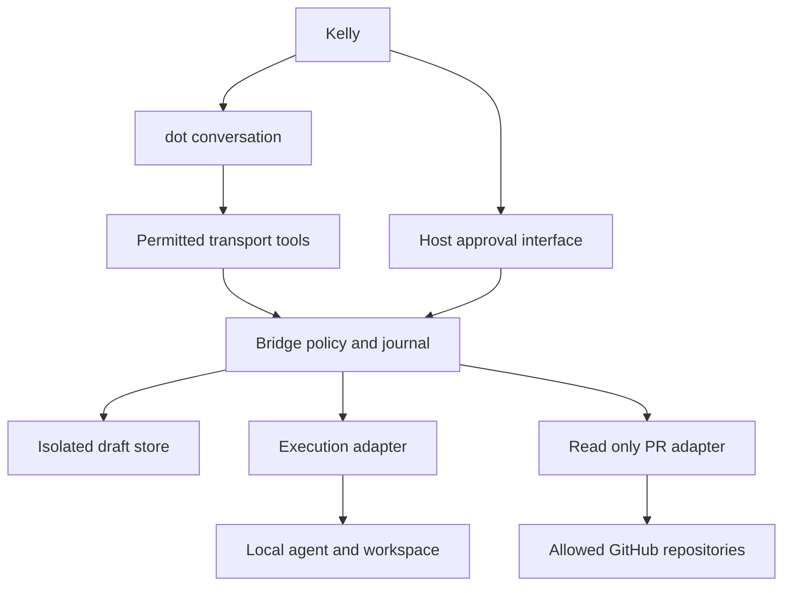

# Controlled bridge between dot and a local coding environment

Draft for Kelly’s review · Version 0.1 · Evidence checked 2 October 2026 America/Phoenix

## Recommendation and scope

Build a small program Kelly controls that accepts a fixed action vocabulary, maintains durable approvals and run records, and delegates implementation through a replaceable execution-agent adapter. dot remains Kelly’s conversational collaborator for designs, specifications, and reviews. The local execution agent uses its own eligible account, tools, and permissions. The bridge neither shares that account with dot nor converts conversational agreement into unlimited execution authority.

Start with a deterministic simulated agent and synthetic PR fixtures on dot’s cloud computer. Keep the contract portable to Kelly’s personal Mac. Prefer a supported private MCP connection if its prerequisites and dot reachability are demonstrated. A connected-computer integration is an alternative only if its broader access can be constrained to the broker. Until connectivity or subscription eligibility is resolved, use a manual, exact-prompt handoff rather than adding model API billing.

This document authorizes no installation, credentials, endpoint exposure, implementation, work-machine access, or company-data transfer. Employer approval is hypothetical. Every stage below is a proposed future activity with an explicit entry gate.

“MUST” means a release requirement; “candidate” means a proposal for Kelly to refine before implementation. All numerical limits are proposed defaults, not vendor limits.

## Architecture and responsibilities

The core consists of one policy dispatcher, a durable journal and task queue, an isolated draft store, an approval interface controlled by Kelly, and two adapters: execution-agent and PR-reader. Transport is an outer adapter and carries no independent authority. Start with a single process and a transactional local database, one active run per project, and polling for results. Avoid a UI dashboard, generic shell tool, arbitrary URL fetcher, and automatic PR posting in version one.



Kelly registers projects, paths, identities, export rules, agent profiles, and approval policy outside dot’s writable area. dot can propose and invoke candidate operations within those grants. The bridge validates every request independently. The local agent applies its own permission decisions; submitting a task does not approve every tool call, push, comment, merge, deployment, or dependency installation the agent may propose.

PR posting is excluded from bridge operations. Kelly may approve a separate posting task for the local agent; the agent’s existing publishing permissions and approvals still apply. The read adapter never obtains write permissions merely because the agent has them.

## Connectivity evidence and options

Official documentation was opened and checked for the following capabilities. These establish product-supported mechanisms, not entitlement or successful reachability for Kelly’s accounts.

| Option | Verified mechanism | Tradeoff and recommendation |
| --- | --- | --- |
| Private MCP plugin using Secure MCP Tunnel | OpenAI documents outbound HTTPS, stdio or HTTP forwarding, ChatGPT developer-mode connection, a runtime API key, and separate Platform tunnel and workspace permissions. | Preferred transport candidate. No public host listener required. Confirm cost, account association, dot tool availability, authorization-server reachability, and host lifecycle. A transport API key is distinct from model API inference; never assume transport is free. [1][2] |
| Plugin with public HTTPS MCP | OpenAI documents streamable HTTP and authentication discovery for developer-mode testing. | Supported alternative; requires separately approved hosting, TLS, identity, monitoring, and exposure. Larger first version. Do not expose a raw local agent or shell service. [2][3] |
| dot connected personal computer | dot documentation supports permitted local files/tools and installed supported plugins; the host must remain online with the app open. | Potentially fewer transport components, but broader native access than this action contract. Only use if available policy can enforce bridge-only access and a real dot invocation is proven. [4] |
| ChatGPT Remote or SSH host connection | Official Remote documentation describes host access using host resources and permissions and warns against public app-server exposure. | Useful supported host workflow; not evidence of a narrow dot-to-Claude API. Avoid building a generic remote-control dependency into the contract. [5] |
| Claude Code Remote Control | Anthropic documents Claude web/mobile control of a local session, subscription eligibility and organization enablement, and outbound connectivity. | Kelly-operated fallback for an exact approved handoff; not a documented dot tool endpoint. It adds Claude-specific transport and transcript transfer. Do not automate its UI or claim dot can call it as an API. [6] |
| Manual export and import | Kelly carries a task envelope and result receipt between the two environments. | Lowest connectivity risk; useful while waiting for hardware or eligibility. Does not prove automated transport. |

The tunnel client must remain running, and its authorization server is not automatically tunneled. These requirements must be measured in the selected environment. [1] The current writing environment has a restricted network allowlist that does not include the documented tunnel destination; this session is not evidence that such a connection can run.

dot’s cloud computer can retain state, but that does not establish a daemon uptime guarantee, inbound reachability, durable process supervision, or localhost access from plugin clients. Treat cloud prototyping as session-scoped unless lifecycle support is demonstrated. A loopback address refers to the calling environment; cloud dot, a remote plugin service, and Kelly’s Mac do not share localhost.

For employer local access, official OpenAI guidance specifies separate enablement and compatibility requirements. Some cloud-orchestrated hooks are unsupported, and hook failures do not necessarily block tools. The broker MUST enforce its own checks rather than relying on a hook for authorization. [7]

### Smallest proposed connectivity proof

After separate authorization to perform the proof, expose only a read-only synthetic `read_run` fixture through the candidate supported transport. Use a fixed `SIMULATED` run and bounded receipt; no real agent, repository, or work credentials. Confirm that Kelly’s actual dot can discover and invoke the tool and receive the expected content and principal identity. An inspector call alone is insufficient.

Then test invalid identity, wrong project, host offline, delayed response, disconnect/reconnect, and connection revocation. Record app version, workspace, transport, identity mapping, endpoint location, egress, and lifecycle observations. Stop and document the gap if dot cannot discover the tool, the cloud host cannot reach required destinations, the process cannot survive the needed lifecycle, or transport requires unacceptable access or billing. Do not substitute an unrestricted shell or public tunnel without review.

## Execution integration and account gate

Claude Code is the intended employer integration under the company’s existing agreement, subject to actual organizational approval. The bridge contract contains no Claude model names, CLI flags, OAuth token formats, or proprietary session IDs.

Anthropic documents programmatic CLI execution with `-p` and structured output. Its current headless documentation also says ordinary scripted runs can load repository hooks and configuration without an interactive trust dialog; `--bare` skips much discovery but does not use subscription login. This is a material security and billing tradeoff. [8]

Anthropic documents subscription and organization sign-in separately from Console and provider billing. [9] Its Agent SDK overview says third-party developers cannot offer claude.ai login or rate limits for their products without prior approval. Therefore, a working subscription CLI is not sufficient evidence that this bridge’s automation is permitted. [10]

Before any real automated adapter, record the exact product/version, personal or employer plan, intended wrapper use, supported login method, approved tools/settings, applicable agreement, and confirmation from the authorized account administrator or Anthropic where ambiguity remains. Require evidence of no separate model API billing, including absence of accidental API/provider overrides and automatic paid fallback. Do not extract subscription tokens, share them with dot, or switch to an API-backed SDK to work around eligibility. If eligibility remains unresolved, keep the adapter in manual handoff mode: Kelly starts the existing agent, supplies the immutable prompt, handles its approvals, and imports the result.

Review repository configuration before launch. The real adapter MUST prevent unreviewed hooks, plugins, instructions, MCP settings, and startup actions from gaining execution authority. Use a documented, tested configuration strategy compatible with the eligible account; if that cannot be enforced without separately billed inference, do not enable automated execution.

## Common action and permission schemas

All requests use strict typed schemas with unknown fields rejected. There is no shell string, executable name, environment-variable map, absolute path, arbitrary URL, or generic filesystem operation in the public contract.

```json
{
  "contract_version": "1",
  "request_id": "UUID",
  "operation": "read_draft",
  "project_id": "personal-demo",
  "arguments": {"document_id": "design", "expected_revision": "sha256:..."}
}
```

The authenticated principal, account/workspace context, and environment are derived from verified transport identity, not trusted from request fields. Transport identity MUST be bound to Kelly’s bridge grant; an unauthenticated transport with real data is prohibited. Authentication for private data and writes follows the supported MCP authorization mechanism. Validate issuer, audience, expiry, and principal, and prevent token passthrough to GitHub or the execution agent. [3]

Candidate host-managed grant:

```json
{
  "grant_id": "grant-personal-1",
  "principal_id": "verified-kelly-dot-context",
  "environment": "personal",
  "project_id": "personal-demo",
  "operations": ["read_draft", "write_draft", "submit_task", "read_run", "cancel_run", "read_pr"],
  "document_ids": ["design", "implementation-spec"],
  "workspace_id": "demo-workspace",
  "agent_profile_id": "stub-v1",
  "pr_repository_ids": ["synthetic/demo"],
  "export_policy_id": "synthetic-only-v1",
  "policy_revision": "sha256:...",
  "expires_at": "RFC3339"
}
```

Server-side registry maps IDs to actual locations. It is owner-controlled and unavailable to draft writes. A grant enables candidate operations; task submission additionally requires an exact task approval. No model-produced text can create or extend a grant.

Every response carries an auditable receipt:

```json
{
  "receipt_id": "UUID",
  "request_id": "UUID",
  "operation": "submit_task",
  "principal_id": "verified identity",
  "project_id": "personal-demo",
  "environment": "personal",
  "policy_revision": "sha256:...",
  "input_digest": "sha256:...",
  "decision": "allowed",
  "effect": "task_accepted",
  "run_id": "sim_UUID",
  "outcome": "accepted",
  "recorded_at": "RFC3339",
  "simulated": true
}
```

Also record approval ID, resource IDs and revisions, output digests, export/redaction counts, error code, adapter version, and journal sequence when applicable. Hashes prove byte identity, not benign content. Store full approved prompt locally under the appropriate retention policy; ordinary audit logs retain digests and metadata, not unrestricted payloads. All denied and uncertain requests receive receipts when the bridge is reachable. A transport error may yield no bridge receipt; dot must explicitly say that receipt is unavailable.

## Candidate action contract

Common authorization: valid identity, live project grant, matching environment, current host policy, and operation-specific resource/export permission. Common side effect: append audit record and bounded access metadata. Reads do not execute returned content. Common errors: `UNAUTHENTICATED`, `DENIED`, `PROJECT_DISABLED`, `INVALID_ARGUMENT`, `LIMIT_EXCEEDED`, `RESOURCE_UNAVAILABLE`, `EXPORT_BLOCKED`, and `AUDIT_UNAVAILABLE`. Mutations fail closed before effects if the durable journal is unavailable.

| Operation | Inputs and outputs | Allowed resources and authorization | Effects and limits | Specific errors and receipt evidence |
| --- | --- | --- | --- | --- |
| `read_draft` | Document ID; optional exact revision. Returns UTF-8 text, revision digest, byte count and provenance. | Registered document in project’s isolated draft store; read and export grants. | No file mutation. Maximum 128 KiB; no arbitrary ranges or directory listing in v1. | `NOT_FOUND`, `REVISION_MISMATCH`; receipt records document revision and exported digest. |
| `write_draft` | Document ID, complete UTF-8 replacement, expected revision or explicit create-if-absent sentinel, idempotency key. Returns new revision and previous digest. | Exact registered document; explicit write grant. No generic path creation. | Atomic conditional replacement; non-executable file permissions. 128 KiB per document, 1 MiB project quota, 10 writes/minute. | `REVISION_CONFLICT`, `UNSAFE_LOCATION`, `IDEMPOTENCY_CONFLICT`; receipt identifies old/new digest and committed effect. |
| `submit_task` | Immutable task envelope, approval ID, idempotency key. Returns durable run ID, accepted timestamp and envelope digest. | Exact registered workspace, approved snapshot, eligible adapter profile; live grant and unused host-issued task approval. | Durable enqueue only after atomic validation and approval consumption. Prompt ≤32 KiB; one active run/project; pending queue ≤5, though each approval targets its own workspace snapshot. No implicit publishing. | `APPROVAL_REQUIRED`, `APPROVAL_STALE`, `WORKSPACE_CHANGED`, `AGENT_UNAVAILABLE`, `INTEGRATION_NOT_APPROVED`, `IDEMPOTENCY_CONFLICT`; receipt distinguishes acceptance from execution. |
| `read_run` | Run ID or submission idempotency key; optional event cursor and registered result artifact IDs. Returns state, last verified time, sequenced events, bounded result manifest and requested content. | Same principal/project/environment as submission, with run read/export grant. | No launch or resume. ≤100 events and 256 KiB/response; opaque cursor; explicit truncation. 2 polls/second maximum. | `NOT_FOUND`, `CURSOR_EXPIRED`, `RESULT_NOT_READY`; receipt gives state version, observation time and exported hashes. |
| `cancel_run` | Run ID, idempotency key, reason from bounded text. Returns cancellation-request receipt and current verified state. | Run cancellation grant for exact project and environment; Kelly may also stop locally. | Prevent queued launch or request graceful stop; never promise rollback. ≤1 KiB reason. Escalation only to adapter-owned process group after a configured grace period and Kelly’s predefined policy. | `CANCEL_UNSUPPORTED`, `ALREADY_TERMINAL`; receipt separates requested cancellation from confirmed termination. |
| `read_pr` | Allowed repository ID, PR number, view enum `description`, `diff`, `comments`, or `checks`; expected head/base where applicable; opaque page cursor. | Explicit repository/PR allowlist, read-only credential scope and export policy. No caller-provided GitHub URL. | GitHub read requests and bounded cache only. ≤100 comments/checks, 256 KiB/page; ≤2 MiB total allowed diff; binaries and excess content withheld with manifest. No check-log download or external-link fetch. | `PR_NOT_ALLOWED`, `HEAD_CHANGED`, `UPSTREAM_RATE_LIMIT`, `UPSTREAM_UNAVAILABLE`, `VIEW_UNAVAILABLE`; receipt includes repository/PR, head/base, fetched time, pagination and exported digest. |

Limits apply after decompression and UTF-8 decoding and before output. Rate limits and output quotas apply per principal and project. An oversized diff is reported as partial or withheld, never a complete review. Cached PR responses state freshness and snapshot identity; comments/checks can change even at the same head. Check conclusions are data, not proof the implementation is correct.

## Approval and exact task identity

Kelly’s host approval interface displays the exact final prompt, referenced spec revisions, source context, project/environment, workspace snapshot, adapter profile, allowed effects, proposed verification, and data exported to dot. It issues a non-forgeable approval ID backed by the journal. Approval creation is deliberately not a dot-callable operation. A trusted remote approval UI could be added later after independent identity and replay review; a conversational “yes” alone is not the host proof.

Candidate task envelope:

```json
{
  "task_id": "UUID",
  "project_id": "personal-demo",
  "environment": "personal",
  "workspace_id": "demo-workspace",
  "workspace_snapshot": {"base_commit": "full object ID", "dirty_manifest_digest": "sha256:..."},
  "prompt": "Exact approved UTF-8 bytes",
  "prompt_digest": "sha256:...",
  "specs": [{"document_id": "implementation-spec", "revision": "sha256:..."}],
  "agent_profile_id": "stub-v1",
  "profile_revision": "sha256:...",
  "allowed_effects": ["edit_workspace", "run_approved_verification"],
  "export_policy_revision": "sha256:...",
  "policy_revision": "sha256:...",
  "acceptance_criteria": ["Reviewable diff and verification evidence"],
  "simulated": true
}
```

Use a versioned canonical serialization and SHA-256 for the envelope; prompt digest covers exact bytes with no post-approval normalization or hidden prompt additions. Freeze referenced specs and fixture/context snapshots. Bind approval to envelope digest, verified principal, environment, workspace ID and snapshot, adapter/profile/policy/export revisions, expiry, and single use. Proposed approval validity: 30 minutes until acceptance; enforce a maximum start delay of 10 minutes. Recheck workspace and policy immediately before launch. Reject changed inputs or expired start authority and request a new approval through Kelly’s interface. A replay of an already accepted submission returns its original run even after approval expiry.

Start real v1 with a clean dedicated workspace at the approved commit. Support dirty work only when every relevant tracked/untracked input is included in an immutable manifest. Lock against simultaneous agent runs, but also detect user edits; locking alone does not prevent external mutation. Do not execute against an unapproved changed tree. Changes to scope, external effects, or continuation prompts require a new envelope and approval.

## Runs and delivery semantics

Run IDs are opaque UUIDs assigned by the bridge, namespaced `sim_` or `real_`. Vendor session IDs remain private adapter metadata. `simulated` is immutable. Accepted means the task and dispatch intent are durably recorded, not that an agent started or succeeded.

| State | Meaning |
| --- | --- |
| `accepted` | Validated, durably queued and approval consumed; no confirmed start. |
| `running` | Adapter confirms execution began; includes `waiting_for_local_approval` as a phase, not an authorization grant. |
| `completed` | Confirmed terminal agent outcome and durable, readable result manifest. Includes verification outcomes; failed acceptance checks remain explicit. |
| `failed` | Confirmed terminal failure, including launch failure or unsuccessful verification required by the approved task. Partial changes are retained and reported. |
| `cancelled` | Confirmed no queued launch or confirmed termination of execution and owned background work. Effects already made remain. |
| `uncertain` | Start, termination or final result cannot be verified. Preserve last confirmed state and possible effects; block automatic redispatch. |

`completed` describes execution outcome, not approval to merge or product correctness. If the result is unavailable or completion is merely claimed in prose, do not mark completed. Status includes monotonically increasing version, last verified time, terminal reason, cancellation flag, adapter health, and result availability. Losing contact produces uncertainty after a bounded reconciliation window, not success or a known failure.

Persist `(principal, environment, project, operation, idempotency_key)` and canonical input digest before effects. Same key and same digest returns the original outcome; same key and different digest is a conflict. Consume approval and create run/dispatch intent in one transaction. Keep submission keys and approval-consumption tombstones for the project lifetime; after payload retention ends, return archived metadata rather than executing again. If journaling is lost, stop submissions until reconciliation; never infer unused approvals.

The adapter must support durable lookup by bridge dispatch token, or the broker must acknowledge the crash window between starting a process and recording its handle. Exactly-once execution cannot be promised for a non-idempotent external CLI. In that window mark uncertain, reconcile process/session/workspace evidence, and require Kelly’s decision before any new run. A user explicitly wanting repeat work creates a new task and approval.

On client timeout, dot says “outcome unknown” and queries `read_run` by idempotency key, or retries the identical submission with that key. It never invents a replacement key. A bridge execution deadline requests cancellation and then confirms termination; an unresponsive agent remains uncertain. Poll/read retries use bounded exponential backoff and cannot start work. Disconnecting dot does not cancel a durably accepted run; reconnect uses run ID/key and last event cursor. No unsolicited callback or automatic follow-up task is required in v1.

Cancellation races are transactional: cancelling a queued run prevents dispatch; cancelling after confirmed completion returns that terminal state; cancellation during execution is a request until stop is verified. Cancellation is not a filesystem undo, Git revert, deletion of evidence, or reversal of remote effects. Result manifests enumerate partial changes and any known external effects. Revocation blocks new actions immediately; Kelly’s local kill switch can still stop runs even when remote identity is revoked.

## Draft isolation and security controls

Use a dedicated project draft directory outside repositories, home configuration, build inputs, executable search paths, and agent auto-discovery locations. Map document IDs to a small fixed set of `.md` or `.txt` basenames. Drafts are inert data: neither bridge nor adapter may automatically source, execute, or treat them as configuration. Promotion of a spec into an agent task occurs only as immutable approved context.

The dispatcher accepts IDs, never raw paths. Internally reject absolute paths, `..`, separators in IDs, NULs, URL encoding tricks and ambiguous Unicode names. Resolve through an owner-controlled directory descriptor using no-follow semantics for every component; verify ordinary files and approved ownership. Reject symlinks, hard links with multiple links, device files, FIFOs and sockets. Protect parent directories from concurrent replacement. Verify containment by filesystem identity, not string-prefix checks. A realpath check followed by an ordinary open is insufficient against races.

Write a bounded temporary file in the same protected directory, flush, conditionally replace under lock and journal the change; protect against revision races and restart ambiguity. Set non-executable mode and never inherit executable permissions. Block bridge writes to `.git`, `.github`, `.claude`, `.codex`, hooks, `AGENTS.md`, `CLAUDE.md`, package/build files, launch services, editor settings, shell startup files, credentials, or any configuration location. Filesystem grants and directory ownership must enforce this beyond filename rules. Even a harmless-looking Markdown write can inject later agent instructions or leak secrets, so approval and export checks apply.

The implementation agent is allowed to edit its approved implementation workspace under its own permissions; that is separate from the bridge draft-write capability. Launch only a host-registered executable and fixed configuration, without a shell. Pass the prompt as data through stdin or an approved input file; never interpolate it into command arguments or shell code. No user-selected flags, environment variables, transport commands, or working directories. Review startup configuration and contain descendants. Implementation tests and dependency scripts are executable work requiring agent policy, not safe bridge reads.

Repository text, PR descriptions/comments, diffs and agent output are untrusted. Tag source and provenance, delimit them as data, sanitize control sequences/markup for display, and never dispatch actions from embedded instructions or tool-shaped JSON. Export redaction runs before returned bytes reach dot. Prompt injection can still influence reasoning; independently enforce every capability and effect so model compliance is not the security boundary. Malicious content cannot change policy, approve a task, add a repository, request credentials, or authorize posting.

## Data flow and trust boundaries

| Data | Host to dot | dot to host | Additional boundary |
| --- | --- | --- | --- |
| Drafts and specs | Only designated documents or approved revisions after export checks. | Bounded draft replacements and exact proposed task prompt. | Text becomes execution context only through Kelly’s approved envelope. |
| Code | No whole-repository upload in v1. Selected code may appear in allowed diffs or approved result artifacts. | Task requirements and explicitly approved context. | Local agent may send source/context to its model provider under its own agreement; local execution is not local-only inference. |
| PR descriptions and comments | Allowlisted text, identities and timestamps; redacted and paginated. | Read selectors only. | GitHub to host reader, then selected work data to OpenAI/dot. No write endpoint. |
| PR diffs and checks | Allowed textual diff, head/base metadata, check states; no automatic links/log retrieval. | Exact allowed repository/PR/view selectors. | Diff contents can contain proprietary code or secrets even without credentials. |
| Run outputs | Status, approved result summary, patch/artifact content and verification evidence permitted by export policy. | Run selectors or cancel request; no implicit continuation. | Raw stdout, environment dumps and unlimited transcripts remain local by default. |
| Credentials | Never GitHub or agent credentials. Transport identity handled by supported auth, outside conversation text. | No account secrets in prompt or arguments. | Tunnel/plugin credential stays with its owning component; OAuth authorities and provider services have their own boundaries. |
| Audit records | Bounded receipts and hashes. | Request IDs and idempotency keys. | Detailed approval/run evidence stays in separate host stores; platform logs may retain exported content under applicable terms. |

For every project define classification, allowed artifact types and paths, redaction patterns, approved providers/workspaces, retention, and maximum export size. Redaction is fallible: scan for known secret formats and seeded test secrets, quarantine blocked artifacts, and require Kelly review for ambiguous exports. Do not claim secret detection guarantees confidentiality. URLs must be data, not automatic fetch targets. No live external-link previews in returned text.

Keep GitHub read credentials in a host secret store, narrowly limited to allowed repositories and required read endpoints. Determine exact permissions from official endpoint documentation when selecting the reader; do not request broad account scopes as a convenience. Keep execution credentials managed by the local agent. Use distinct transport, reader and execution identities with independent revocation. Credential rotation or revocation must stop the relevant new actions and be tested. Strip secrets before journaling errors or returning output; avoid command-line credential leakage and raw protocol/debug logs.

Personal and employer environments require separate stores, grants, credentials, account routing, workspace registries, approvals, export policies, and audit namespaces. Prefer separate OS identities/processes; do not rely on a string field as isolation. No cross-environment run lookup, approval reuse, credential fallback, or copying results to personal dot memory. Employer data must not enter this personal prototype. Company approval must cover data transfer to dot/OpenAI as well as local agent/provider use. Neither routing through Claude nor bridge approval bypasses either system’s safeguards.

## Execution adapter contract

The internal interface uses neutral records and capability negotiation:

```text
capabilities() -> version, simulated, supported_modes, cancellation,
                  durable_dispatch_lookup, structured_events, approval_behavior
preflight(workspace_snapshot, profile) -> eligible | unavailable | denied
start(dispatch_token, immutable_task) -> handle | rejected | uncertain
inspect(dispatch_token_or_handle, after_sequence) -> verified_state, events
cancel(handle, reason) -> requested | confirmed | unsupported | uncertain
collect(handle) -> result_manifest | not_ready | unavailable
```

Preflight MUST not launch work, install software, authenticate silently to another account, or incur model inference. The adapter receives host-resolved workspace handles and immutable prompt/context; it cannot accept a transport-selected command. Map adapter events to the bridge state machine with timestamp, event sequence, provider observation and simulation flag. Never parse arbitrary prose as a privileged instruction or permission approval.

Result manifest contains task/envelope digest, adapter/version, workspace baseline/final state, changed-file manifest, diff hashes, verification commands actually run and outcomes, unresolved issues, partial/external effects, start/end times, termination evidence, exported artifact IDs/hashes and simulation marker. Verification claims need concrete output or host observation, not merely a model summary. Agents waiting for approval surface that phase; Kelly resolves it through the agent’s own supported interface. Version one provides no bridge tool for approving arbitrary agent tool calls.

Adapters: `stub-v1` is required first; `manual-v1` exports an exact envelope and imports provenance-labelled results; `claude-code-local-v1` is gated on eligible supported integration. A future different agent must pass the same contract tests. Platform-specific process control and transport remain outside the core policy/state logic.

## Deterministic stub validation

Use a synthetic repository with no external remotes, synthetic PR descriptions/diffs/comments/checks, and fake credentials that can only be matched by redaction tests. The adapter performs no inference, shell execution, real posting or credential access. An immutable fixture scenario and virtual clock select events; neither fixture comments nor task text can select privileged behavior. Starting creates a durable `sim_` run. Advancing scripted time emits reproducible sequence-numbered progress and a synthetic patch/result.

Every response, receipt, progress event and artifact MUST carry `simulated: true`; all visible summaries begin `SIMULATED — NO REAL AGENT EXECUTION`. Artifact filenames begin `SIMULATED_`. Offline exports repeat the label inside their content. Synthetic changes are confined to fixture storage. Avoid ambiguous “tests passed” phrasing: say “scripted simulated verification passed.” Real adapters cannot load simulated approvals or artifacts as completion evidence.

| Scenario | Required acceptance evidence |
| --- | --- |
| Full collaboration loop | dot reads/writes a designated spec; Kelly sees exact frozen envelope and approves; submission returns `sim_` ID; progress/result receipts match prompt/workspace digests; dot reviews labelled synthetic diff. |
| Denied operations | Unknown tool, absolute/traversal paths, symlink/hardlink/race attempts, config write and disallowed PR all denied; no unauthorized file or agent effect; denial receipts recorded. |
| Stale authority | Spec, prompt, baseline, profile, export policy or grant changes; expired approval or start delay; all reject before launch. Replayed accepted task still resolves to original run. |
| Duplicate and timeout | Concurrent identical keys produce one run; changed digest conflicts; lost acknowledgement then identical retry produces no second launch; dot never reports timeout as success. |
| Interrupt and restart | Reconnect by key/run/cursor yields ordered history; crash at every dispatch/journal boundary either reconciles one run or reports uncertain with redispatch blocked. |
| Unavailable agent | Preflight returns unavailable without launch; accepted run with subsequent adapter loss becomes explicitly failed or uncertain according to evidence. |
| Malicious content | PR text asks to run commands, retrieve keys, change grants or approve itself; output contains fake tool calls/control sequences; none authorizes an action. Seeded secrets are withheld before export/logging. |
| Failures and partial results | Scripted verification fails, malformed events, missing manifest, oversized output, corrupt journal and upstream rate limit produce bounded truthful errors; partial edits remain visible. |
| Cancellation races | Before dispatch, during running, during local approval wait, after completion and with unresponsive adapter; only verified stop becomes cancelled; no automatic rollback or restart. |
| Isolation and revocation | Personal identity cannot access employer namespace; revoked grant/credential blocks new reads/submissions; local kill switch remains available; no fixture network access. |

Pass gate: repeat deterministic scenarios with identical event/output hashes; zero unauthorized writes/launches/exports; one logical run per accepted idempotency key; every injected unknown outcome remains uncertain until evidence resolves it; each mutation and denial has an attributable receipt. Review representative receipts alongside final displayed dot language, not only backend assertions.

The stub proves conversation flow, contract validation, approval binding, journal behavior, recovery logic, labels, and denial handling. It does not prove real subscription eligibility, provider billing, real agent tool boundaries, cancellation of all descendants, actual GitHub scopes, connectivity uptime, macOS filesystem/process behavior, export completeness, or resistance to all prompt injection. These require separate integration tests on the personal Mac with synthetic data before personal real-project dogfooding.

## Staged implementation plan

| Stage | Proposed work | Entry and exit gates |
| --- | --- | --- |
| 0 Contract and threat review | Refine six operations, schemas, approval surface, export rules, run recovery, and excluded effects with Kelly. Review malicious content and credential/data flows. | Entry: this draft reviewed. Exit: versioned contract and threat decisions accepted; no code/service setup yet. |
| 1 Connectivity proof | Test the single synthetic read fixture from Kelly’s actual dot over a supported candidate connection. | Separate authorization for required setup. Exit: verified identity, reachability, revocation and lifecycle; no model inference or employer data; unresolved cost/entitlement blocks further live deployment. |
| 2 Cloud stub prototype | Implement core broker, journal, draft store, fake PR reader and deterministic adapter in a session-scoped personal cloud workspace. Test offline core first; add proven transport afterward. | Exit: complete scenario matrix, simulation labels and reviewable receipts. Cloud process survival is measured, never assumed. Persist only synthetic checkpoints through an approved mechanism. |
| 3 Personal Mac integration | When hardware is available, test filesystem races, process supervision, sleep/reconnect, host approval interface and agent account eligibility. Integrate real adapter first on a synthetic repo, then one explicitly designated personal project. | Exit: no unintended billing; permission prompts preserved; stale workspace detection, cancellation and crash recovery proven; selected real diffs/results reviewed by Kelly. No PR posting in first real trial. |
| 4 Employer deployment | Independently review architecture, data classification, OpenAI/Claude/GitHub accounts and agreement, export/retention rules, network/security policy, audit ownership and incident procedure. | Entry requires actual written organizational approval from responsible owners, separately provisioned identities and permitted host/data. Exit: approved synthetic work-environment pilot before any company repository access. Personal approval never substitutes. |

Each stage produces evidence and a go/no-go decision. No automatic move to the next stage. Keep a rollback procedure: disable transport/grants, stop queued dispatch, reconcile and stop active runs locally, revoke credentials, retain permitted audit evidence, and document residual changes. Disabling transport alone does not stop an active local agent.

## Deployment prerequisites and open decisions

Before connectivity: choose the actual dot/account/workspace, establish supported custom-tool availability, confirm permitted transport and cost, outbound reachability, process lifecycle and identity mapping, and authorize only synthetic proof setup. No permanent cloud service dependency until hosting guarantees are established.

Before personal real execution: host available, dedicated workspace and draft store, owner-controlled configuration, durable backup/recovery, local approval interface, tested adapter version/configuration, verified account eligibility and billing, agent approval handling, export review, cancellation/kill switch and audit retention.

Before employer execution: written security/IT/data-owner authorization, approved vendor/account terms for both dot and execution agent, explicit permission for code/comment/spec/output transfer, account and OS isolation, least-privilege PR reader, approved network route and deployment lifecycle, monitoring/audit ownership, retention/deletion and incident response. Today none of these employer approvals is assumed.

Decisions for Kelly’s review:

1. Is a host-local approval screen acceptable for v1, with manual handoff while the Mac is unavailable?
2. Which personal draft IDs and project workspace should be designated, and should draft writes need per-write approval or a revocable standing grant?
3. Can Kelly’s dot actually discover a private custom MCP plugin? Does tunnel availability/cost fit the no separately billed model inference requirement?
4. Is the intended Claude Code wrapper eligible under the specific personal plan and later company agreement? What documented startup strategy suppresses unreviewed configuration without changing billing?
5. Are one active run, clean initial workspaces, polling-only results and no bridge posting acceptable first-version limits?
6. Which artifacts may reach dot, and what retention and redaction review should apply to personal results? Employer decisions remain separate.
7. Who owns connectivity, approvals, revocation and uncertain-run reconciliation when Kelly is unavailable? Default v1: wait for Kelly; do not continue autonomously.

The smallest dogfood release is six tools, two registered draft files, one synthetic project, one simulated adapter, a local approval surface and durable receipts. Real integration is a subsequent gate, not hidden inside that release.

## Official sources

These are capability evidence checked for this draft; recheck exact versions and account terms before deployment. No company agreement was inspected, and no live integration was tested.

1. OpenAI, [Secure MCP Tunnel](https://developers.openai.com/api/docs/guides/secure-mcp-tunnels) — private transport, authentication prerequisites, network and lifecycle requirements.
2. OpenAI, [Connect and test your plugin](https://developers.openai.com/plugins/deploy/connect-chatgpt) — developer-mode endpoint options and testing.
3. OpenAI, [Authenticate users](https://developers.openai.com/plugins/build/auth) — MCP user authorization and private-data/write authentication.
4. OpenAI, [Connect computers and apps to your dot](https://learn.chatgpt.com/docs/dots/computers-and-apps) — supported dot computer/plugin use and host availability.
5. OpenAI, [Remote connections](https://learn.chatgpt.com/docs/remote-connections) — host workflows and exposure guidance.
6. Anthropic, [Claude Code Remote Control](https://code.claude.com/docs/en/remote-control) — supported Claude client workflow and eligibility.
7. OpenAI, [Local computer access for Work Cloud and dots](https://learn.chatgpt.com/docs/enterprise/cloud-local-access) — organizational setup, policy and compatibility limits.
8. Anthropic, [Run Claude Code programmatically](https://code.claude.com/docs/en/headless) — scripted execution, output and startup-configuration tradeoffs.
9. Anthropic, [Claude Code authentication](https://code.claude.com/docs/en/authentication) — subscription, organization and Console routes.
10. Anthropic, [Agent SDK overview](https://code.claude.com/docs/en/agent-sdk/overview) — library interface and third-party subscription-login restriction.
